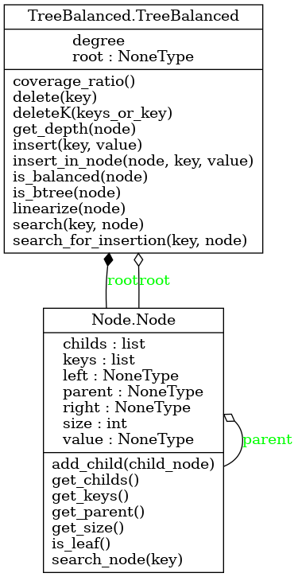

# Projet S6

# Binôme:
- Sara Lyna Ouyahia
- Mahiedine Ferdjoukh

# Présentation du projet et son lien avec le concept Objets :
Ceci est un projet en Python-objets, structuré avec des Arbre-B (Arbre-Balanced),
Un arbre de recherche est un dictionnaire qui préserve le classement d'une fonction spécifiée par l'utilisateur, également connue sous le nom de dictionnaire trié.
C'est globalement une implémentation d'un arbre n-aire équilibré avec une vue (une fenetre ) et une intéraction avec l'utilisateur,
ce qui pourra permettre à l'utilisateur d'intéragir en temps réel avec la fenetre et construire l'arbre. en ajoutant/supprimant des noeuds/feuilles.
La notion d'objets sera exploré en faisant hériter la classe TreeBalanced (classe principale) de la classe Node,
la notion de python objet sera exploré en créant des objets node, key, tree ...ect, et en faisant directement les opérations nécessaires dessus.
créer une fenêtre graphique (par exemple, en utilisant PyQt) pour afficher notre arbre équilibré, on peut encapsuler la logique d'affichage dans une classe spécifique à l'interface utilisateur Window ! Cela permettra de séparer clairement la logique de l'arbre et celle de l'interface utilisateur, suivant le principe de la séparation des préoccupations.

## How To :

il suffit de lancer les tests unitaires directement dans le repertoire test
ou via la commande :
- `pipenv run test`

pour formater le code on utilise :
- `pipenv run format`
il également : 
- `pipenv run lint`

## UML :
[Diagramme UML (Lucid)](https://lucid.app/lucidchart/5362c04a-0055-4e38-96f6-b98e7b2418df/edit?view_items=hKf4u7b5I~bl&invitationId=inv_490324e7-3726-4202-810b-056d2cf5ce4e)

Commandes pour créer l'UML :

- `pyreverse -o png -p node -A -my -S Node.py`
- `pyreverse -o png -p tree_Balanced -A -my -S TreeBalanced.py`

## Journal de bord :

### Semaine 1 :
#### Mercredi 10 Janvier :
- Réflexion sur la manière d'implémenter un arbre binaire de recherche équilibré de manière originale.
- Possibilité de coder une sorte d'intéraction avec l'utilisateur pour lui permettre d'intéragir avec la fenetre et créer de lui meme un arbre.
- Ajouter des options telles que l'ajout ou la suppression de noeuds/feuilles.
- Commencer à créer les classes dés cette semaine.
- Mettre en surbrillance les noeuds auquels on veut ajouter des clés (par exemple).
- Rendre l'interface intéractive et drole (ajouter des chemins colorés pour les clés nouvellement ajoutées).
- Explorer le double clic sur un noeud ou le passage de la souris dessus.
- D'abord commencer par afficher le squelette de l'arbre binaire équilibré.

### Semaine 2 :
#### Mercredi 17 Janvier :
- Modification de l'UML et ajout des différentes méthodes et relations entre les classes.
- Codage de la classe Node.py et implémentation de ses différentes méthodes.
- Suppression de la classe MyTree.py car seule la classe TreeBalanced nous intéresse finalement.
- Codage de la classe TreeBalanced.py et implémentation de ses méthodes essentielles telles que init() search_value(), search_bool() et is_Btree().
- Pour cette semaine seul l'algorithme de recherche est demandé, on a fait un algo de recherche qui retourne une valeur(celle de la clé) et un 2eme algo qui retourne un booléen qui nous informe de la présence ou pas de la clé.
- En deuxième lieu on a fait les tests, les tests des méthodes de la classe Node.py
- Réalisation des tests de la classe TreeBalanced.
- On a essayé de réaliser la structure de l'arbre.
- Rectification de quelques erreurs dans la classe TreeBalanced, après le lancement des tests.

### Semaine 3 :
#### Mercredi 24 Janvier :
- Installation de pipenv sur le poste de travail afin d'automatiser les tests.
- Modification de l'algorithme de recherche avec des améliorations.
- Codage de l'algorithme de linéarisation afin de tester l'ordre croissant des clés.
- Tests pour les méthodes search(), linearize(), is_btree().
- Modification de l'UML pour être en concordance avec le code.
- Rédaction du Readme.
- Finalisation des tests.
- Fin de la recherche et de la linéarisation.

### Semaine 4 :
#### Mercredi 31 Janvier :
- Ajout de la fonction pour calculer la profondeur d'un nœud.
- Ajout d'une fonction pour vérifier si l'arbre est équilibré en passant sa racine en paramètre.
- Amélioration de l'algorithme de recherche.
- Passage des tests de is_balanced + de la fonction de get_depth qui retourne la profondeur d'un nœud.

### Semaine 5 :
#### Mercredi 7 Février :
- Ajout de la fonction insert : insère la clé et la valeur demandées. Si aucune racine n'existe, crée une nouvelle. Sinon, recherche un emplacement approprié pour l'insérer en utilisant la fonction search_for_insertion.
- Ajout de la fonction insert_in_node : ajoute la clé à la liste des clés du nœud, réorganise les clés, etc.
- Ajout de la fonction search_for_insertion : recherche l'emplacement approprié pour insérer une clé.
- commencement des tests sur l'insertion.

- Tests finis sur les méthodes d'insertion , à priori tout fonctionne très bien.
- Implémentation de la méthode search_for_deletion().
- Réflexion sur la logique de la suppression.
- Modification et codage de méthodes dans la classe Window afin de visualiser correctement l'arbre.
- Ajout des options de recherche de clé/valeur dans la classe window.
- Suppression des fichiers inutiles.

## Insertion dans un Arbre B

L'opération d'insertion dans un arbre B se déroule en plusieurs étapes :

1. **Recherche de l'endroit d'insertion :** La clé à insérer est recherchée dans l'arbre B en descendant depuis la racine jusqu'à atteindre une feuille appropriée.

2. **Insertion dans le nœud :** Une fois l'endroit d'insertion trouvé, la clé est insérée dans le nœud approprié. Si le nœud dépasse sa capacité maximale après l'insertion, il est divisé en deux parties.

3. **Division/éclatement du nœud :** La division du nœud se fait en extrayant la clé médiane et en créant un nouveau nœud pour contenir les clés de droite. Les clés et les enfants du nœud d'origine sont mis à jour pour ne contenir que les clés et les enfants de gauche.

4. **Réorganisation de l'arbre :** Si le nœud divisé avait un parent, la clé médiane est insérée dans le parent. Sinon, un nouveau nœud parent est créé, et les nœuds d'origine et nouveau sont définis comme enfants de ce parent. Si le nœud d'origine était la racine de l'arbre, la racine de l'arbre est mise à jour avec le nouveau parent.

### Semaine 6 :
#### Mercredi 14 Février :
- Modifications du fichier Pipfile.
-
-
-
-

### Semaine 7 : 

#### Mercredi 21 Février :
- étudier tous les cas possibles lors de la suppression d'une clé
- ajout de quelques test pour la classe Node
- début d'implementation de la suppression
- création de la methode _delete qui supprime une clé
- création des méthodes auxiliaires qui permet la restructuration du code et facilite sa compréhension.

### Suppression dans un Arbre B-Tree

La suppression dans un arbre B-Tree suit un algorithme spécifique pour garantir que la structure de l'arbre reste équilibrée tout en supprimant une clé spécifiée.

#### Algorithme de Suppression

1. **Vérification de la présence de la racine :** 
    - Vérifie si l'arbre a une racine. Si la racine est vide, la suppression est abandonnée car il n'y a rien à supprimer.

2. **Suppression récursive :** 
    - La suppression commence par appeler une méthode de suppression récursive `_delete` en passant la racine de l'arbre et la clé à supprimer comme arguments.

3. **Recherche de la clé :**
    - Parcourt les clés du nœud actuel pour trouver l'index de la clé à supprimer.

4. **Cas de la clé trouvée :**
    - Si la clé à supprimer est trouvée dans le nœud actuel :
        - Si le nœud est une feuille, la clé est supprimée.
        - Sinon, la méthode détermine s'il existe des clés successeurs ou prédécesseurs dans les nœuds enfants pour remplacer la clé à supprimer.
            - Si des successeurs ou prédécesseurs existent et ont suffisamment de clés, la méthode met à jour la clé actuelle avec le successeur ou le prédécesseur approprié, puis répète la suppression dans le nœud enfant correspondant.
            - Sinon, la méthode fusionne le nœud avec son voisin et poursuit la suppression dans le nœud fusionné.

5. **Cas de clé non trouvée :**
    - Si la clé n'est pas trouvée dans le nœud actuel, la méthode poursuit la recherche dans le nœud enfant approprié, en fonction de la valeur de la clé et de la disposition des clés dans le nœud actuel.

6. **Méthodes Auxiliaires :**
    - Plusieurs méthodes auxiliaires sont utilisées pour aider à la suppression :
        - `_get_predecessor` et `_get_successor` : pour obtenir respectivement le prédécesseur et le successeur d'une clé.
        - `_merge` : pour fusionner un nœud avec son voisin.
        - `_fill` : pour remplir un nœud en empruntant une clé d'un nœud voisin si nécessaire.
        - `_borrow_from_prev` et `_borrow_from_next` : pour emprunter une clé d'un nœud voisin précédent ou suivant.

## UML DES CLASSES 

## Sources à regarder :

`docs.python-guide.org/writing/structure`

`packaging.python.org/en/lates+/tutorials/packaging-projects`

`McCreight, E.M. (1972), "Organization and maintenance of large ordered
indexes" (PDF), Acta Informatica`

`https://www.cs.usfca.edu/~galles/visualization/BTree.html`

`https://www.youtube.com/watch?v=coRJrcIYbF4`

## exemple de jeux :

- redblobgames.com (triangulation)
- thomas was alone
- oxyd , brainies/sqweek
- Robo Rally
- Ray tracer ? (gémoétrie + maths)

## Explication du fonctionnement du projet et des classes :
À suivre ...